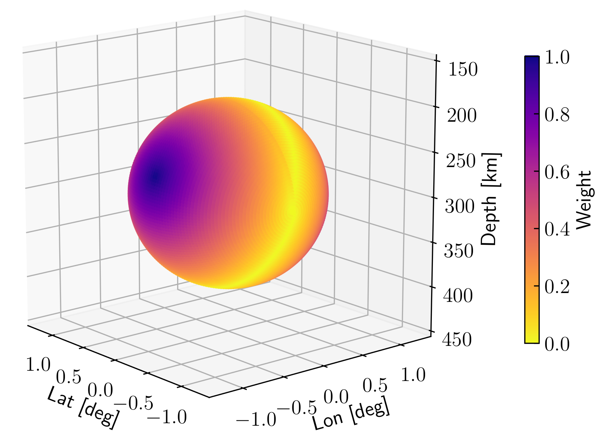

# SCOTER

Multiple-event location by using static and source-specific station correction terms.


## Dependencies

* Python (>= 2.7, < 3, with development headers)
* Numpy (>= 1.13.1)
* Scipy (>= 0.19.1)
* [PyYaml](http://pyyaml.org/wiki/PyYAML) (>= 3.11)
* [progressbar2](https://pypi.python.org/pypi/progressbar2)
* [Pyrocko](http://pyrocko.org/) (>= 2017.11.22)
* [NonLinLoc](https://gitlab.com/nimanshr/stater-nonlinloc) (== 7.00.0)


## Download and Installation

1. Install [Pyrocko](https://pyrocko.org/):  
    See Pyrocko installation page [here](https://pyrocko.org/docs/current/install/).  

2. Install NonLinLoc:  
    See NonLinLoc repository that is modified and packaged as SCOTER backend [here](https://gitext.gfz-potsdam.de/nooshiri/scoter-nonlinloc.git).  

3. Install SCOTER and the rest of dependencies:  

    ```bash
    cd ~/src/   # or wherever you keep your source packages
    git clone https://gitext.gfz-potsdam.de/nooshiri/scoter.git
    cd scoter
    sudo python setup.py install
    ```


## Relocation Method

**SCOTER** implements the so-called shrinking-box source-specific station terms
(SSST) technique (Richards-Dinger & Shearer, 2000; Lin & Shearer, 2005) to
reduce the effect of spatially correlated residuals caused by 3-D velocity
structure. The method has been extended to regional and teleseimic distances and
the algorithm has been adopted for probabilistic, non-linear, global-search
location (Nooshiri et al., 2017). By using this technique, a set of *P*- and/or
*S*-wave station corrections is computed iteratively for each source-receiver path.
Therefore, the time corrections for each station vary as a function of source
position. The calculated station terms are added to the travel times computed from
the velocity model to take unmodelled structure into account. Thus, the travel-time
residual misfit function to be minimized is a function of station terms in addition to
earthquake hypocentre parameters.

The basic algorithm applied is described by the following steps:
1. First, all the earthquakes are located with the actual arrival times.
2. Then, an SSST is calculated for each source-receiver pair as the mean of the
residuals from at most $`N`$ neighbouring events which are located within a sphere
of radius $`R_{max}`$ around the target event and have picks at the station in
question.
3. The original arrival time picks are corrected by the calculated SSSTs ($`T^{\prime obs}_{ij}=T^{obs}_{ij}-s_{ij}`$).
4. Then, the earthquakes are relocated with these corrected arrival times.
5. The above steps are repeated iteratively.

Optionally, based on the initial locations, a set of static station terms can be
calculated for each station and phase (*P* and/or *S*) and then used as a
starting point for the SSST calculation.


## The NonLinLoc Backend

The original SSST algorithm is adopted for probabilistic, non-linear, global-search
location method implemented in the software package NonLinLoc (Lomax et al., 2000).
The **SCOTER** tool relies on this backend (external program) to do the actual event
location part of the calculation (see Nooshiri et al. (2017) for more details).


## New Weighting and Re-weighting Scheme

**SCOTER** allows each neighbouring event to be directly weighted during the
iterative station terms calculation. The weights are defined according to the
inter-event distance and residual performance. These criteria are revisited
after each location iteration.


### Distance Weight

To further reduce the effect of the unmodelled velocity structure outside the
source region, residuals for neighbouring events located at far distances can be
down-weighted using a bi-cubic function:
```math
W_{i}^{d}=\left(  max\left\lbrace 0, 1-\left( \dfrac{d_{i}}{R_{max}}\right)^3 \right\rbrace \right)^3 ,
```
where $`d_i`$ is the inter-event distance between target and neighbouring events,
and $`R_{max}`$ is the cut-off distance.


### Effective Distance Weight

In order to more efficiently reduce the velocity heterogeneity effects for
events with large separation distances, each nearby event can be weighted as a
function of both inter-event distance and the angle $`\alpha`$ between the
relative position vector of target-neighbour events pair and the ray take-off
direction computed at the target event with respect to the recording station:
```math
W_{i}^{\alpha,d}=1-\left( \left( 1-W_{i}^{d}\right) \cdot\dfrac{\alpha}{90}\right) ,
```
where $`W_{i}^{d}`$ is the distance weight described above. In this way,
neighbouring events whose relative position vectors are along the ray take-off
direction ($`\alpha \sim 0`$) are given full weights, since they share more
common ray paths with the target event outside the focal area, regardless of
their distance to the target event. This equation equals the distance weight
when neighbouring event relative position vector is perpendicular to the target
event ray take-off direction ($`\alpha \sim 90`$), and the model errors have
greatest effects. This weighting approach is specially useful in global SSST
location where seismic rays leaving the sources at different angles relative to
the target event ray take-off direction.

<p align="center">

</p>


### Residual Outliers Rejection

**SCOTER** can detect the outliers in the travel-time residuals distribution and
remove them from the residuals list when calculating station terms:
```math
  W_{i}^{r}=\begin{cases}
    1, & \left( \dfrac{r_{i}}{\kappa \cdot \mathbf{r}_{\text{smad}} } \right)^2 \leq 1, \\
    0, & \text{otherwise}
    \end{cases}
```
where $`r_i`$ is the travel-time residual, $`\mathbf{r}_{\text{smad}}`$ is the
scaled median absolute deviation of the residuals, and $`\kappa`$ is a factor
defining the rejection level. The scaled median absolute deviation (smad) is a
robust measure of the spread of a distribution, which is equal to the standard
deviation for Gaussian distribution.


## Location Steps

**SCOTER** can be run for single-event relocation (Single) without any station
terms, static station terms relocation (Static), and source-specific station
terms relocation (SSST). For simplicity, these steps are named as **A**, **B**,
**C**, respectively:

| Step name | Description |
|:---------:| ---------------------- |
|   **A**   | single-event location (without any station terms) |
|   **B**   | static station terms location |
|   **C**   | source-specific station terms location |

Therefore, any desired relocation step(s) can be re-run, for instance, to play
around with different configurations.


## Command Line Examples

```shell
# To get further help and a list of available options and subcommand:
scoter --help
scoter <subcommand> --help

# To get an example configuration file:
scoter init myconfig.sf

# To run SCOTER:
scoter go myconfig.sf --steps=A,B,C --parallel=8
```


## Example Configuration File

```yaml
%YAML 1.1
--- !gp.Config

# Path, where to store output files (run-directories)
rundir: './out'

# -----------------------------------------------------------------------------
# Configuration section for dataset (input data)
# -----------------------------------------------------------------------------

dataset_config: !gp.DatasetConfig

  # File with hypocenter information and possibly reference solution
  events_path: './events.pf'

  # Files with pick information (NLLOC_OBS format).
  # NOTE - Given template path must have the placeholder ``${event_name}``
  bulletins_template_path: './obs/${event_name}.nll'

  # File with stations information
  stations_path: './meta/stations-complete-geofon.sf'

  # Delimiter string used as the network code and station code separator
  # character. Used to split the station labels, and to join network codes
  # and station codes when hypocenter-phase files are read and written,
  # respectively (optional)
  delimiter_str: '.'

  # Path and file root name (no extension) for input time grids (generated by
  # program Grid2Time, edu.sc.seis.TauP.TauP_Table_NLL, or other softwares)
  traveltimes_path: './time/ak135'

  # Files with pre-computed takeoff angles (SPTree interpolators) (optional).
  # NOTE - Given template path must have the placeholder ``${phase_label}``
  takeoffangles_template_path: './angle/ak135.${phase_label}.DEFAULT.angle.pf'

# -----------------------------------------------------------------------------
# Configuration section for static station terms
# -----------------------------------------------------------------------------

static_config: !gp.StaticTermsConfig

  # Number of iterations for static station terms
  niter: 1

  # List of direct phases (P and/or S) for which static terms are computed
  phase_list: ['P', 'S']

  # Minimum number of residuals required to compute static term for each
  # station and phase (P or S)
  nresiduals_min: 5

# -----------------------------------------------------------------------------
# Configuration section for source-specific station terms
# -----------------------------------------------------------------------------

ssst_config: !gp.SourceSpecificTermsConfig

  # Number of iterations for source-specific station terms
  niter: 5

  # List of direct phases (P and/or S) for which SSST values are computed
  phase_list: ['P', 'S']

  # Starting distance cutoff in [m] for SSST computation
  start_cutoff_dist: 100000.0

  # Starting maximum number of nearby events for SSST computation
  start_nlinks_max: 100

  # Ending distance cutoff in [m] for SSST computation
  end_cutoff_dist: 25000.0

  # Ending maximum number of nearby events for SSST computation
  end_nlinks_max: 20

  # Minimum number of nearby events (i.e. residuals) required to compute
  # SSST value for each source-receiver path
  nlinks_min: 5

  # Minimum number of adjusted picks (i.e. station terms) for each event
  # required to consider it in SSST iterations
  ndelays_min: 4

# -----------------------------------------------------------------------------
# Configuration section for weighting and re-weighting scheme
# -----------------------------------------------------------------------------

weight_config: !gp.WeightConfig

  # How to weight nearby events located around a target event. This
  # option is valid for SSST computation. (available choices are
  # 'uniform', 'distance', 'effective_distance') (optional, default='uniform')
  distance_weighting: 'uniform'

  # Whether to apply residual outliers rejection (detect large travel
  # time residuals that should not be used in station terms calculation).
  # (optional, default=true)
  apply_outlier_rejection: true

  # Cutoff threshold type for residual outliers. (available choices are
  # 'static', 'dynamic') (optional, default='dynamic')
  outlier_rejection_type: 'dynamic'

  # Cutoff threshold level for residual outliers. For 'static' cutoff, it
  # is the absolute threshold in [s]. For 'dynamic' cutoff, it is a factor
  # to multiply the scaled median absolute deviation (SMAD) of the residuals.
  # (optional, default=6)
  outlier_rejection_level: 6

# -----------------------------------------------------------------------------
# Configuration section for location quality control
# -----------------------------------------------------------------------------

locqual_config: !gp.LocationQualityConfig

  # Events with low-quality locations (i.e. do not satisfy the following
  # conditions) are not used in station terms calculation.

  # Maximum location RMS in [s].
  standard_error_max: 3.0

  # Maximum secondary azimuthal gap in [deg].
  secondary_azigap_max: 180.0

  # Maximum semi-major axis of the confidence ellipsoid in [m]
  # (corresponding to the largest location uncertainty).
  largest_uncertainty_max: 111000.0

# -----------------------------------------------------------------------------
# Configuration section for station network selection
# -----------------------------------------------------------------------------

network_config: !gp.NetworkConfig

  # Whether to select (filter) station data based on epicentral (surface)
  # distances. The distances are calculated based on the initial locations
  # of the events (optional, default=false)
  station_selection: false

  # Minimum epicentral distance in [deg] (optional, default=0.0)
  station_dist_min: 0.

  # Maximum epicentral distance in [deg] (optional, default=180.0)
  station_dist_max: 90.

# -----------------------------------------------------------------------------
# Configuration section for NonLinLoc controlling parameters
# (for descriptions see NonLinLoc documentation)
# -----------------------------------------------------------------------------

nlloc_config: !gp.NLLocConfig

  trans: !gp.NLLocTrans
    # Geographic transformation parameters (see TRANS)
    # NOTE - if `trans_type` is 'SIMPLE' or 'LAMBERT', you need to set
    # some more parameters, named as `lat_orig`, `lon_orig`, `rot_angle`,
    # `ref_ellips`, `first_paral`, `second_paral`.
    trans_type: 'GLOBAL'


  grid: !gp.NLLocGrid
    # 3D search grid parameters (see LOCGRID)
    x_num: 11
    y_num: 11
    z_num: 71
    x_orig: 80.0
    y_orig: 25.0
    z_orig: 0.0
    dx: 1.0
    dy: 1.0
    dz: 10.0
    grid_type: 'PROB_DENSITY'

  search: !gp.NLLocSearchOcttree
    # Oct-tree search type parameters (see LOCSEARCH)
    init_num_cells_x: 10
    init_num_cells_y: 10
    init_num_cells_z: 7
    min_node_size: 0.01
    max_num_nodes: 30000
    num_scatter: 10000
    use_sta_density: 0
    stop_on_what: 0

  meth: !gp.NLLocMeth
    # Location method (algorithm) parameters (see LOCMETH)
    method: 'EDT_OT_WT'
    max_dist_sta_grid: 100000.0
    min_num_phases: 8
    max_num_phases: 200
    min_num_Sphases: -1
    vp_vs_ratio: -1.7
    max_num_3dgrid_mem: -1
    min_dist_sta_grid: -1.0
    duplicate_arrivals: 1

  gau: !gp.NLLocGau
    # Gaussian model errors parameters (see LOCGAU)
    sigma_time: 0.5
    corr_len: 0.0

  gau2: !gp.NLLocGau2
    # Travel-time dependent model errors parameters (see LOCGAU2)
    sigma_tfraction: 0.01
    sigma_tmin: 0.05
    sigma_tmax: 2.0

  phaseid_list:
  # List of phase identifier mapping (see LOCPHASEID)
    # pP phase subsection
  - !gp.NLLocPhaseid
    std_phase: 'pP'
    phase_code_list: ['pP', 'pwP']
    # P phase subsection
  - !gp.NLLocPhaseid
    std_phase: 'P'
    phase_code_list: ['P', 'p', 'Pn', 'Pg', 'Pb']
    # S phase subsection
  - !gp.NLLocPhaseid
    std_phase: 'S'
    phase_code_list: ['S', 's', 'Sn', 'Sg', 'Sb']

  elevcorr: !gp.NLLocElevcorr
    # Vertical ray elevation correction parameters (see LOCELEVCORR)
    activation_flag: 1
    vel_p: 5.80
    vel_s: 3.46

  stawt: !gp.NLLocStawt
    # Station distribution weighting parameters (see LOCSTAWT)
    activation_flag: 1
    cutoff_dist: -1.0

# -----------------------------------------------------------------------------
# End of the config file
# -----------------------------------------------------------------------------
```


## SCOTER Overview Poster (EGU 2018)

<p align="center">

</p>


## References

- Lin, G. and Shearer, P. (2005). Tests of relative earthquake location
techniques using synthetic data. *J. Geophys. Res.*, 110(B4). B04304.
- Lomax, A., Virieux, J., Volant, P., and Berge-Thierry, C. (2000).
Probabilistic earthquake location in 3D and layered models. In Thurber, C. and
Rabinowitz, N., editors, *Advances in Seismic Event Location*, volume 18 of
*Modern Approaches in Geophysics*, pages 101-134. Springer Netherlands.
- Nooshiri, N., Saul, J., Heimann, S., Tilmann, F., and Dahm, T. (2017).
Revision of earthquake hypocentre locations in global bulletin data sets using
source-specific station terms. *Geophys. J. Int*, 208(2):589–602, https://doi.org/10.1093/gji/ggw405
- Richards-Dinger, K. B. and Shearer, P. M. (2000). Earthquake locations in
southern California obtained using source-specific station terms. *J. Geophys. Res.*, 105(B5):10939-10960.
